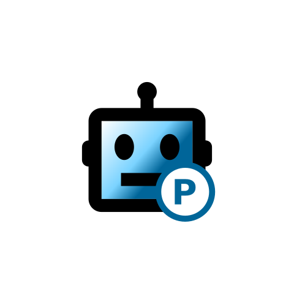

# ParkingBot Backend



## About

This is the backend for the ParkingBot app and runs on Google App Engine for Python.

## Getting started

Create an app engine project.

Enable Datastore.

Configure the `.env` file.

Configure the `.app.yaml` file.

Deploy using the CLI from inside the folder with the yaml:

```
gcloud app deploy
```

## Local

Change working dir to `parking-bot`.

Create local server certificate:

```
mkcert localhost 127.0.0.1 ::1
```

Create a python virtual environment:

```
python -m venv .venv
```

Activate the virtual environment and run pip:

```
python -m pip install -r requirements.txt
```

Run using vscode `Run and Debug` functions.

Browse swagger at [localhost:8000](https://127.0.0.1:8000/docs).
